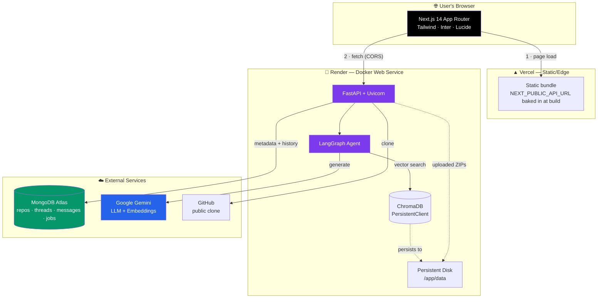
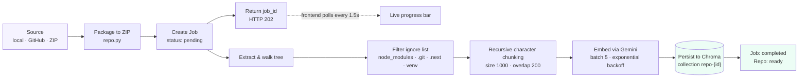
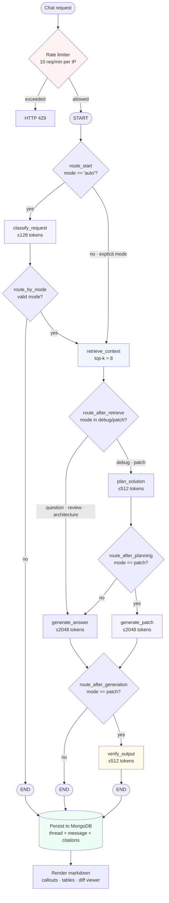
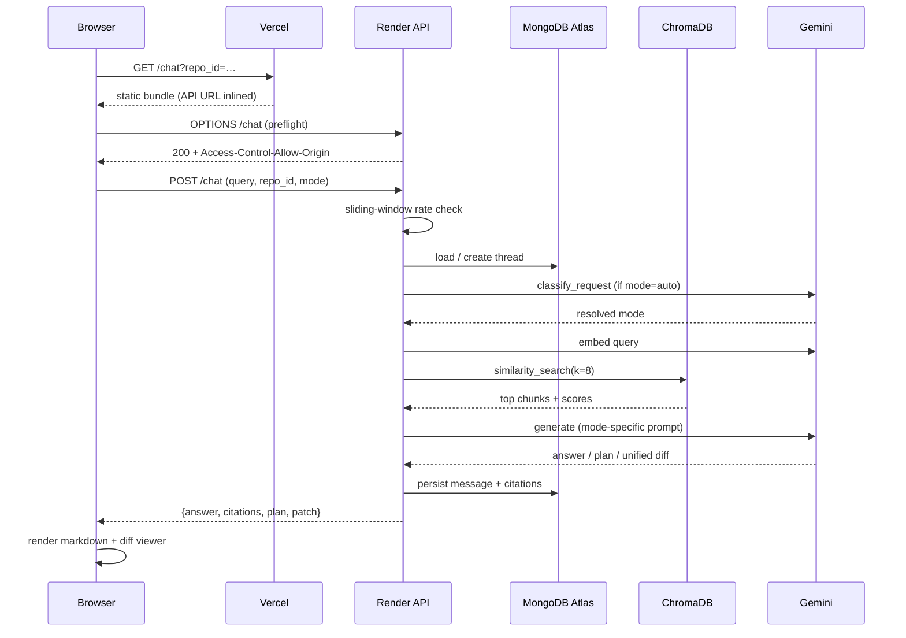
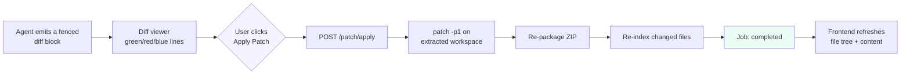

# CodePilot RAG — Autonomous AI Coding Assistant & Context Engine

CodePilot RAG ingests a software workspace, indexes it semantically, and answers
questions about it with citations — then goes further: it finds bugs, reviews code
quality, explains architecture, and generates **unified git diffs you can apply in
one click**.

It is a multi-agent system. A LangGraph state machine classifies each request,
retrieves the most relevant code chunks from a vector store, and routes the work to
a purpose-built engine depending on what you actually asked for.

---

## 🔗 Live Deployment

| Surface | URL | Host |
| :--- | :--- | :--- |
| **Web App** | **https://frontend-theta-olive-55.vercel.app/** | Vercel |
| Backend API | https://codepilot-snj4.onrender.com | Render |
| API Docs (Swagger) | https://codepilot-snj4.onrender.com/docs | Render |
| Health Check | https://codepilot-snj4.onrender.com/health | Render |
| Database | MongoDB Atlas (M0) | Atlas |

> **Note on the live demo:** the "Local Directory" ingestion tab only works when the
> backend runs on your own machine. On the hosted deployment, use **GitHub URL** or
> **ZIP upload** — see [Production Limitations](#-production-limitations).

---

## 📚 Table of Contents

- [Live Deployment](#-live-deployment)
- [Architecture](#-architecture)
- [How It Works — Full Workflow](#-how-it-works--full-workflow)
- [Core Features](#-core-features)
- [Tech Stack](#-tech-stack)
- [Project Structure](#-project-structure)
- [API Reference](#-api-reference)
- [Environment Variables](#-environment-variables)
- [Running Locally](#-running-locally)
- [Deployment Guide](#-deployment-guide)
- [Production Limitations](#-production-limitations)
- [Troubleshooting](#-troubleshooting)

---

## 🏗 Architecture

The frontend and backend are deployed independently. The browser talks directly to
the Render API — there is no proxy — which is why CORS configuration is load-bearing.



**Why the persistent disk matters:** both the Chroma index and uploaded ZIP archives
are written to local disk. Without a mounted disk they vanish on every restart, and
you get a nasty split-brain — MongoDB still lists the repository as `ready`, while
retrieval silently returns nothing and downloads 404.

---

## ⚙️ How It Works — Full Workflow

### Stage 1 · Ingestion Pipeline

Ingestion is asynchronous. The API returns a `job_id` immediately and the frontend
polls `/jobs/{job_id}` every 1.5s to render a live progress bar.



Embeddings are submitted in batches of 5 with exponential backoff, because free-tier
Gemini keys rate-limit aggressively. See [`vectorstore.py`](backend/app/services/vectorstore.py).

### Stage 2 · LangGraph Agent Routing

This is the heart of the system. The graph is defined in
[`graph.py`](backend/app/agent/graph.py) with six nodes and five conditional routers.



**Routing rules, precisely:**

| Router | Condition | Destination |
| :--- | :--- | :--- |
| `route_start` | `mode == "auto"` | `classify_request` |
| | otherwise | `retrieve_context` (skips classification) |
| `route_by_mode` | mode ∈ {question, debug, patch, review, architecture} | `retrieve_context` |
| | otherwise | `END` |
| `route_after_retrieve` | mode ∈ {debug, patch} | `plan_solution` |
| | otherwise | `generate_answer` |
| `route_after_planning` | `mode == "patch"` | `generate_patch` |
| | otherwise | `generate_answer` |
| `route_after_generation` | `mode == "patch"` | `verify_output` |
| | otherwise | `END` |

Only **patch** mode passes through verification — reviews and architecture answers
are returned directly, which is why they come back noticeably faster.

### Stage 3 · Request Lifecycle



### Stage 4 · Patch Application



---

## ⚡ Core Features

### Six Reasoning Modes

| Mode | Icon | What it does | Verified? |
| :--- | :--- | :--- | :--- |
| **Auto Router** | ⚡ | Classifies intent and dispatches to the right engine | — |
| **Q&A** | ❓ | Answers questions about the indexed codebase | No |
| **Debug** | 🐛 | Plans first, then traces failures to root cause | No |
| **Patch Generator** | 🛡 | Plans → generates unified diff → verifies | **Yes** |
| **Code Review** | 👁 | Quality report with severity indicators | No |
| **Architecture** | 📖 | Explains layers, flows and boundaries | No |

### Three Ingestion Sources

- **Local Directory** — absolute path on the host running the backend. Sweeps the
  tree, applies the ignore list, packages and indexes. *Local deployments only.*
- **GitHub Import** — clones any public repository over HTTPS.
- **ZIP Archive** — drag-and-drop upload, 100 MB default cap.

### Grounded Citations

Every response carries the file paths and snippets it was retrieved from, rendered as
chips under the message.

> ⚠️ **Known gap:** citations are attached only when the model reproduces a file path
> as a literal substring in its prose ([`nodes.py:140`](backend/app/agent/nodes.py)).
> A summary-style answer that never spells out a path drops all of its citations even
> though retrieval worked. Fixing this means citing from `retrieved_chunks` by score
> rather than string-matching the output.

### Rate Limiting & Token Caps

A sliding-window limiter in [`chat.py`](backend/app/api/routes/chat.py) allows
**10 chat requests per minute per IP**, guarded by `asyncio.Lock`, returning HTTP 429
on violation. Generation is capped per call type to keep free-tier quota usable:

| Call | Cap |
| :--- | ---: |
| `classify` | 128 |
| `retrieve` | 64 |
| `plan` | 512 |
| `verify` | 512 |
| `generate` / `patch` | 2048 |

### Frontend Design System

- White, Inter-based system — black pill buttons, hairline borders, subtle shadows
- Staggered `fadeInUp` entrance animations with `prefers-reduced-motion` fallback
- Auto-cycling hero tab bar with per-tab overlay cards
- Four accent themes (Nebula / Aurora / Sunset / Ocean) persisted to `localStorage`
- Rich markdown renderer: emoji callouts (⚠️ 💡 ℹ️ 🔴), GitHub tables, language-tagged
  code blocks, mode-accented message borders
- Full diff viewer with line numbers and add/remove/hunk coloring

---

## 🧰 Tech Stack

| Layer | Technology |
| :--- | :--- |
| Frontend | Next.js 14 (App Router), React 18, TypeScript, Tailwind CSS 3.4, Lucide |
| Backend | FastAPI, Uvicorn, Pydantic Settings |
| Agent | LangGraph, LangChain |
| LLM | Google Gemini (`models/gemini-2.5-flash`), OpenAI fallback |
| Embeddings | `models/gemini-embedding-2` (3072-dim) |
| Vector Store | ChromaDB (embedded PersistentClient) |
| Database | MongoDB + Beanie ODM + Motor |
| Container | Docker, docker-compose |
| Hosting | Vercel (frontend) · Render (backend) · MongoDB Atlas (database) |

---

## 📂 Project Structure

```text
copilot-reviewer/
├── backend/
│   ├── app/
│   │   ├── agent/
│   │   │   ├── graph.py           # StateGraph topology + 5 conditional routers
│   │   │   ├── llm.py             # Provider factory + per-call token caps
│   │   │   ├── nodes.py           # classify · retrieve · plan · generate · patch · verify
│   │   │   ├── prompts.py         # Mode-specific prompt templates
│   │   │   └── state.py           # AgentState TypedDict
│   │   ├── api/routes/
│   │   │   ├── chat.py            # Chat + threads + sliding-window rate limiter
│   │   │   ├── repo.py            # Ingestion (local · github · zip), files, download
│   │   │   ├── patch.py           # Unified diff application
│   │   │   └── jobs.py            # Background job status
│   │   ├── models/
│   │   │   ├── db_models.py       # Beanie documents: Repository, Thread, Message, Job
│   │   │   └── schemas.py         # Pydantic request/response models
│   │   ├── services/
│   │   │   ├── ingestion.py       # Async parser + chunker
│   │   │   ├── memory.py          # Beanie init + thread/message persistence
│   │   │   └── vectorstore.py     # Chroma client + batched embedding
│   │   ├── utils/
│   │   │   ├── diff_utils.py      # Unified diff parsing/apply
│   │   │   └── file_parser.py     # Language detection, ignore lists
│   │   ├── config.py              # Pydantic Settings loader
│   │   └── main.py                # Lifespan, CORS, router registration
│   ├── Dockerfile                 # Production image (binds $PORT, no --reload)
│   ├── .dockerignore
│   └── requirements.txt
│
├── frontend/
│   ├── src/
│   │   ├── app/
│   │   │   ├── page.tsx           # Landing — hero, tab previews, FAQ
│   │   │   ├── dashboard/page.tsx # Repo grid/list, search, sort, stats
│   │   │   ├── ingest/page.tsx    # 3-source ingestion console + live progress
│   │   │   ├── chat/page.tsx      # Workspace: threads, files, diff, chat
│   │   │   ├── globals.css        # Design system + animations + markdown styles
│   │   │   └── layout.tsx         # Root layout, metadata, fonts
│   │   └── lib/api.ts             # Typed API client
│   ├── tailwind.config.js
│   ├── postcss.config.js
│   └── package.json
│
├── docker-compose.yml             # Local stack: backend, frontend, mongo, chroma
├── render.yaml                    # Render blueprint (backend)
├── .env.example
└── README.md
```

---

## 🔌 API Reference

Base URL: `https://codepilot-snj4.onrender.com`

### System
| Method | Endpoint | Description |
| :--- | :--- | :--- |
| `GET` | `/` | Service metadata |
| `GET` | `/health` | MongoDB + ChromaDB status |
| `GET` | `/docs` | Swagger UI |

### Repositories
| Method | Endpoint | Description |
| :--- | :--- | :--- |
| `POST` | `/repos/upload` | Ingest ZIP (`file`) or clone (`github_url`) → `202 {job_id}` |
| `POST` | `/repos/local` | Ingest an absolute server-side path → `202 {job_id}` |
| `GET` | `/repos` | List all indexed repositories |
| `DELETE` | `/repos/{repo_id}` | Delete repo, documents and Chroma collection |
| `GET` | `/repos/{repo_id}/files` | List indexed file paths |
| `GET` | `/repos/{repo_id}/files/content?path=` | Read one file's contents |
| `GET` | `/repos/{repo_id}/download` | Download workspace as ZIP |

### Chat & Threads
| Method | Endpoint | Description |
| :--- | :--- | :--- |
| `POST` | `/chat` | Run the agent. Body: `{query, repo_id, thread_id?, mode?}` |
| `GET` | `/threads/{repo_id}` | List threads for a repository |
| `GET` | `/threads/{thread_id}/messages` | Full message history |
| `DELETE` | `/threads/{thread_id}` | Delete a thread |

### Patch & Jobs
| Method | Endpoint | Description |
| :--- | :--- | :--- |
| `POST` | `/patch/apply` | Apply a unified diff, then re-index |
| `GET` | `/jobs/{job_id}` | Poll background job progress |

**Example**

```bash
curl -X POST https://codepilot-snj4.onrender.com/chat \
  -H "Content-Type: application/json" \
  -d '{
    "query": "Explain the project structure and main entry point.",
    "repo_id": "your-repo-id",
    "mode": "question"
  }'
```

---

## 🔑 Environment Variables

Defined in [`backend/app/config.py`](backend/app/config.py). Loaded from `../.env`
then `.env`, relative to the backend working directory.

### Required
| Variable | Default | Description |
| :--- | :--- | :--- |
| `GOOGLE_API_KEY` | `""` | Gemini API key (LLM + embeddings) |
| `MONGODB_URL` | `mongodb://localhost:27017` | Connection string. Atlas uses `mongodb+srv://…` |

### LLM
| Variable | Default |
| :--- | :--- |
| `LLM_PROVIDER` | `gemini` (`gemini` \| `openai`) |
| `GEMINI_MODEL` | `models/gemini-2.5-flash` |
| `EMBEDDING_MODEL` | `models/gemini-embedding-2` |
| `OPENAI_API_KEY` / `OPENAI_MODEL` | `""` / `gpt-4o` |
| `AGENT_TEMPERATURE` | `0.1` |

### Storage
| Variable | Default | Notes |
| :--- | :--- | :--- |
| `MONGODB_DB_NAME` | `copilot_rag` | Applied separately from the URL |
| `CHROMA_HOST` / `CHROMA_PORT` | `localhost` / `8001` | **Leave unset in production** — forces the embedded PersistentClient |
| `CHROMA_PERSIST_DIR` | `./chroma_data` | Point at the mounted disk on Render |
| `UPLOAD_DIR` | `./uploads` | Point at the mounted disk on Render |
| `MAX_UPLOAD_SIZE_MB` | `100` | |

### Networking
| Variable | Default | Notes |
| :--- | :--- | :--- |
| `CORS_ORIGINS` | `localhost:3000` list | Comma-separated, exact scheme+host match |
| `CORS_ORIGIN_REGEX` | `""` | Regex for Vercel preview hostnames. `re.fullmatch`. Keep narrow — credentials are enabled |
| `API_HOST` / `API_PORT` | `0.0.0.0` / `8000` | Render injects `PORT` instead |

### Retrieval Tuning
| Variable | Default |
| :--- | :--- |
| `CHUNK_SIZE` / `CHUNK_OVERLAP` | `1000` / `200` |
| `MAX_CHUNKS_PER_FILE` | `50` |
| `RETRIEVAL_K` | `8` |

---

## 💻 Running Locally

### Option A — Docker Compose (everything at once)

```bash
cp .env.example .env      # then fill in GOOGLE_API_KEY
docker compose up --build
```

| Service | URL |
| :--- | :--- |
| Frontend | http://localhost:3000 |
| Backend | http://localhost:8000 |
| Swagger | http://localhost:8000/docs |
| Mongo Express (optional) | http://localhost:8081 — `docker compose --profile debug up` |

The compose file overrides the image `CMD` to re-enable `--reload`, so backend edits
hot-reload through the `./backend/app` bind mount.

### Option B — Manual

**1. Start MongoDB**

```bash
docker compose up -d mongodb
```

ChromaDB needs no container — leaving `CHROMA_HOST`/`CHROMA_PORT` unreachable makes
[`vectorstore.py`](backend/app/services/vectorstore.py) fall back to an embedded
`PersistentClient` automatically.

**2. Backend**

```bash
cd backend
python -m venv venv
venv\Scripts\activate          # Windows
# source venv/bin/activate     # macOS / Linux

pip install -r requirements.txt
python -m uvicorn app.main:app --host 127.0.0.1 --port 8000 --reload
```

Verify: `curl http://127.0.0.1:8000/health` →
`{"status":"ok","services":{"mongodb":"ok","chromadb":"ok"}}`

**3. Frontend**

```bash
cd frontend
npm install
npm run dev
```

Open http://localhost:3000.

---

## 🚀 Deployment Guide

### 1 · MongoDB Atlas

Render offers no managed MongoDB, so the database lives on Atlas.

1. Create a free **M0** cluster.
2. **Database Access** → add a user.
3. **Network Access** → allow `0.0.0.0/0` (Render's Starter tier has no static
   outbound IPs). Use a strong password.
4. Copy the SRV string. Percent-encode special characters in the password —
   `@` → `%40`, `#` → `%23`, and so on.

```
mongodb+srv://<user>:<password>@<cluster>.mongodb.net/?retryWrites=true&w=majority
```

> `dnspython` is pinned in `requirements.txt` specifically for this. `pymongo` does
> not require it on its own, and without it every `mongodb+srv://` URI raises
> `ConfigurationError` at startup — which `main.py` turns into `sys.exit(1)`,
> crash-looping the container.

### 2 · Backend on Render

Create a **Blueprint** pointing at this repo; [`render.yaml`](render.yaml) declares
the service, the disk and every variable.

| Setting | Value |
| :--- | :--- |
| Root Directory | `backend` |
| Runtime | Docker |
| Instance Type | **Starter or higher** (free has no disk) |
| Health Check Path | `/health` |
| Disk Mount | `/app/data`, 1 GB |

Secrets are marked `sync: false` and entered in the dashboard — never committed:

```
MONGODB_URL       = mongodb+srv://…
GOOGLE_API_KEY    = …
CORS_ORIGINS      = https://frontend-theta-olive-55.vercel.app,http://localhost:3000
CORS_ORIGIN_REGEX = https://frontend-[a-z0-9-]+-<your-team>-projects\.vercel\.app
```

> `*.onrender.com` subdomains are **globally unique**. If your chosen name is taken,
> Render assigns a suffixed hostname — read the real URL from the dashboard rather
> than assuming it.

### 3 · Frontend on Vercel

```bash
cd frontend
npx vercel link
echo "https://your-service.onrender.com" | npx vercel env add NEXT_PUBLIC_API_URL production
npx vercel --prod
```

> **The redeploy is mandatory.** `NEXT_PUBLIC_*` variables are inlined into the JS
> bundle at build time, not read at runtime. Setting the variable without rebuilding
> changes nothing.

Verify the value actually shipped:

```bash
curl -s https://<your-app>.vercel.app/dashboard \
  | grep -o '/_next/static/chunks/app/dashboard/[^"]*\.js' \
  | head -1
# then fetch that chunk and grep for your Render hostname
```

### 4 · Verify CORS

The browser calls Render directly, so this is the step that most often fails silently.

```bash
curl -sD - -o /dev/null -X OPTIONS \
  -H "Origin: https://frontend-theta-olive-55.vercel.app" \
  -H "Access-Control-Request-Method: POST" \
  -H "Access-Control-Request-Headers: content-type" \
  https://codepilot-snj4.onrender.com/chat | grep -i "http/\|allow-origin"
```

Expect `200` **and** an `access-control-allow-origin` header. A `400` with no such
header means the origin isn't in `CORS_ORIGINS` — the request will fail in the
browser even though the backend is perfectly healthy.

---

## ⚠️ Production Limitations

**Local Directory ingestion doesn't work when hosted.**
[`repo.py`](backend/app/api/routes/repo.py) resolves the path against the *server's*
filesystem. On Render that's the container, not your machine, so it always 400s. Use
GitHub URL or ZIP upload on the live deployment.

**Free Render instances lose all state.** No persistent disk means the Chroma index
and uploaded ZIPs are wiped on each restart, while MongoDB still reports repositories
as `ready`. Retrieval returns nothing and downloads 404. Use Starter or above.

**Cold starts exceed the LLM timeout.** Free instances sleep after ~15 minutes idle
and take ~50s to wake, while [`llm.py`](backend/app/agent/llm.py) caps requests at
45s. The first request after idle will usually fail.

**Preview deployments need the regex.** `CORS_ORIGINS` only covers hostnames you can
name in advance. Vercel previews get a fresh random hostname per build, so they
require `CORS_ORIGIN_REGEX`. Keep the pattern scoped to your own team slug — since
`allow_credentials=True`, something like `https://.*\.vercel\.app` would let any
Vercel-hosted site make credentialed calls to your API.

**Citations can silently drop.** See the [Grounded Citations](#grounded-citations)
note above.

---

## 🔧 Troubleshooting

| Symptom | Likely cause | Fix |
| :--- | :--- | :--- |
| `/health` → `mongodb: error` | Atlas credentials or IP allowlist | Check password encoding; allow `0.0.0.0/0` |
| Container crash-loops on boot | `dnspython` missing for SRV URI | Confirm it's installed in the image |
| Browser: CORS error, but `curl` works | Origin missing from `CORS_ORIGINS` | Add the exact scheme+host, no trailing slash |
| Frontend still calls `localhost:8000` | Env var set but not rebuilt | Redeploy — `NEXT_PUBLIC_*` is build-time |
| Repo shows `ready` but answers have no context | Chroma index lost on restart | Attach a persistent disk |
| First request after idle times out | Free-tier cold start | Upgrade instance, or retry |
| `HTTP 429` from `/chat` | Sliding-window limiter | 10 req/min per IP — wait, or raise `_CHAT_RATE_LIMIT` |
| Embedding fails mid-ingest | Gemini free-tier quota | Backoff already retries 5×; reduce batch size |

---

## 📄 License

Provided as-is for educational and demonstration purposes.

---

<div align="center">

**[🚀 Open the Live App](https://frontend-theta-olive-55.vercel.app/)** ·
[API Docs](https://codepilot-snj4.onrender.com/docs) ·
[Health](https://codepilot-snj4.onrender.com/health)

Built with FastAPI · LangGraph · ChromaDB · MongoDB · Next.js

</div>
