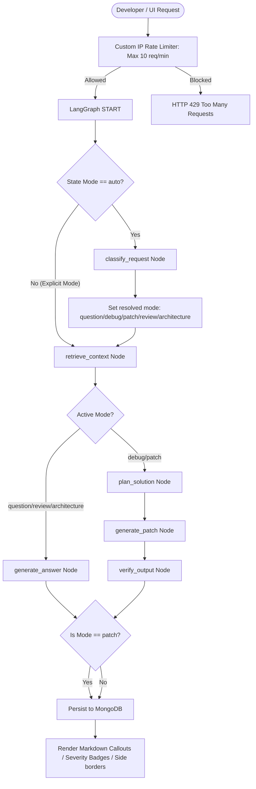

# CodePilot RAG — Autonomous AI Coding Assistant & Context Engine

CodePilot RAG is a premium, multi-agent AI assistant designed to ingest software workspaces, run context-rich vector retrievals, and support developer tasks like Q&A, debugging, code audits, architecture charting, and autonomous git patch generation.

---

## 🗺️ System Flow & Agent Architecture

The following diagram illustrates how user requests enter the pipeline, pass through the rate-limiting filter, undergo LangGraph mode classification, retrieve ChromaDB vector contexts, execute LLM generations with strict token limits, and render premium, interactive views on the frontend.

### LangGraph Agent & Routing Flowchart


---

## 📂 Project Directory Structure

```text
copilot-reviewer/
├── backend/
│   ├── app/
│   │   ├── agent/                 # LangGraph Multi-Agent Engine
│   │   │   ├── graph.py           # Conditional routing and graph topology
│   │   │   ├── llm.py             # LLM provider & token limits (max_output_tokens)
│   │   │   ├── nodes.py           # Classification, Retrieval, Planning, Answer & Patch nodes
│   │   │   └── prompts.py         # Structured Markdown templates per mode
│   │   ├── api/
│   │   │   └── routes/
│   │   │       ├── chat.py        # Chat interaction, thread management & custom sliding-window IP rate limiter
│   │   │       ├── repo.py        # Codebase ingestion (local folder, github clone, zip)
│   │   │       └── jobs.py        # Background indexing status tracking
│   │   ├── models/
│   │   │   ├── db_models.py       # MongoDB schemas (Repository, Job, Thread, Message)
│   │   │   └── schemas.py         # API pydantic request/response validation
│   │   ├── services/
│   │   │   ├── ingestion.py       # Async parser & vector segment chunker
│   │   │   ├── memory.py          # MongoDB / Beanie initializations
│   │   │   └── vectorstore.py     # ChromaDB similarity search client
│   │   ├── config.py              # Settings loader
│   │   └── main.py                # FastAPI lifespans & CORS middlewares
│   ├── tests/                     # Integration tests
│   └── requirements.txt           # Python packages
│
├── frontend/
│   ├── src/
│   │   ├── app/
│   │   │   ├── page.tsx           # Product Landing Page (CTAs to Dashboard and Ingest Console)
│   │   │   ├── dashboard/
│   │   │   │   └── page.tsx       # Full-width indexed codebase listing & global stats view
│   │   │   ├── ingest/
│   │   │   │   └── page.tsx       # Package Console: local folder, git clone, zip upload tabs
│   │   │   ├── chat/
│   │   │   │   └── page.tsx       # Chat interface, side board plan/patch view, rich markdown renderer
│   │   │   ├── globals.css        # Multi-theme stylesheet presets
│   │   │   └── layout.tsx         # Root styles and fonts loader
│   │   └── lib/
│   │       └── api.ts             # API wrappers for endpoints
│   └── package.json               # Node.js dependencies
│
├── docker-compose.yml             # Local MongoDB & Redis stack orchestrator
└── README.md                      # Documentation
```

---

## ⚡ Core Features

### 1. Ingestion Console (`/ingest` Page)
*   **Local Directory Path**: Package any absolute directory on the host computer. CodePilot sweeps files, filters exclude list (`node_modules`, `.git`, `.next`, `venv`), and indexes them.
*   **GitHub Import**: Clone public Git repositories over HTTPs.
*   **ZIP Archive**: Direct drag-and-drop of zip repositories.

### 2. Space-Efficient Workspace Selector (`/dashboard` Page)
*   Shows a full-width clean summary of active codebases.
*   Presents global statistics (Total repositories, total indexed source files, total vector chunks).
*   Allows deleting indexed codebases, clearing database documents and Chroma collection mappings.

### 3. Internal IP-Based Rate Limiting (`chat.py`)
*   Protects server APIs and LLM key resources with a sliding-window rate limit: **Max 10 requests per minute per IP**.
*   Locks are handled asynchronously using `asyncio.Lock` to avoid concurrency collisions.
*   Returns an `HTTP 429 Too Many Requests` code on violation.

### 4. Generation Token Caps (`llm.py`)
*   Caps generation bounds to avoid runaway requests:
    *   `classify`: 128 tokens
    *   `planning`: 512 tokens
    *   `verification`: 512 tokens
    *   `generation`: 2048 tokens

### 5. Interactive Markdown Renderer (`chat/page.tsx` & `globals.css`)
*   **Callouts**: Transforms blockquotes containing emojis (⚠️/💡/ℹ️/🔴) into styled alert banners with matching backgrounds.
*   **Tables**: Auto-converts GitHub-style table formats.
*   **Code Blocks**: Appends header bars displaying syntax language tags (e.g. JavaScript, Python).
*   **Side borders**: Bubbles are styled with mode-specific accent boundaries (Teal for architecture, Red for debug, Purple for questions, Amber for reviews).

---

## 🚀 Running Locally

### 1. Prerequisite Infrastructure
Ensure you have MongoDB running on `mongodb://localhost:27017` and ChromaDB initialized. You can start local MongoDB using Docker:
```bash
docker-compose up -d mongodb
```

### 2. Run the FastAPI Backend
Create environment variables in `backend/.env`:
```env
APP_NAME="CodePilot RAG"
GOOGLE_API_KEY="your-gemini-api-key"
LLM_PROVIDER="gemini"
GEMINI_MODEL="models/gemini-2.5-flash"
EMBEDDING_MODEL="models/gemini-embedding-2"
MONGO_URI="mongodb://localhost:27017/copilot-rag"
CHROMADB_HOST="localhost"
CHROMADB_PORT="8000"
```

Start the server:
```bash
cd backend
# Create and activate virtual environment
python -m venv venv
venv\Scripts\activate

# Install requirements
pip install -r requirements.txt

# Run server with hot-reload
python -m uvicorn app.main:app --host 0.0.0.0 --port 8000 --reload
```

### 3. Run the Next.js Frontend
```bash
cd frontend
# Install dependencies
npm install

# Run hot dev server on port 3000
npm run dev
```
Open `http://localhost:3000` to access the platform.
